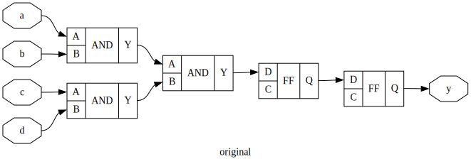
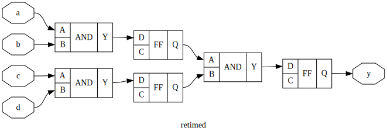
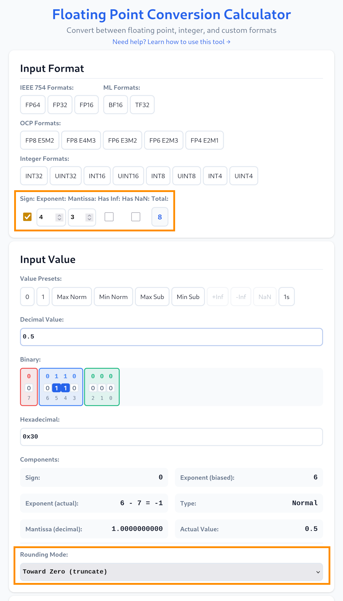

<!---

This file is used to generate your project datasheet. Please fill in the information below and delete any unused
sections.

You can also include images in this folder and reference them in the markdown. Each image must be less than
512 kb in size, and the combined size of all images must be less than 1 MB.
-->

## How it works
This project came about with the simple question: _Can we write lazy HDL and let the tools optimize our sloppiness?_

Spoiler: We absolutely can!


### The Idea: Retiming
It is very easy to write combinational logic. Ignore the clock, just simply do everything at once, use deep MUX trees, _if else if if else else if_ and so on. But that has a cost. The result will have a very long critical path and timing closure will be almost impossible. Sure at clock frequencies of a few _kHz_ this is an non-issue. But try to target anything faster and your design will not reach timing closure.

Registers to the rescue! We _could_, like its usually done, partition the design in logical _steps_ and add flip-flops inbetween to effectively pipeline the design. Thats everything but easy. Whole new HDL languages have came to be just because this is not easy. See PipelineC for example.

But we are lazy and want to test what the tools can do about it. So we simply add, after our _lazy_ design, a few (or many) flip-flops back-to-back like a shift register. That does not change what is computed, but simply introduces latency, i.e. the output is delayed by N clocks. The excellent ABC tool from Alan Mishchenko, which is mostly integrated into Yosys, then does the heavy lifting and _retimes_ the flip-flops to wherever it results in the minimal delay.

<!-- ```
digraph "original" {
label="original";
rankdir="LR";
remincross=true;
n1 [ shape=octagon, label="y", color="black", fontcolor="black"];
n7 [ shape=octagon, label="d", color="black", fontcolor="black"];
n8 [ shape=octagon, label="c", color="black", fontcolor="black"];
n9 [ shape=octagon, label="b", color="black", fontcolor="black"];
n10 [ shape=octagon, label="a", color="black", fontcolor="black"];
{ rank="source"; n10; n7; n8; n9;}
{ rank="sink"; n1;}
c15 [ shape=record, label="{{<p13> D|<p12> C}|FF|{<p14> Q}}",  ];
c16 [ shape=record, label="{{<p13> D|<p12> C}|FF|{<p14> Q}}",  ];
c21 [ shape=record, label="{{<p18> A|<p19> B}|AND|{<p20> Y}}",  ];
c22 [ shape=record, label="{{<p18> A|<p19> B}|AND|{<p20> Y}}",  ];
c23 [ shape=record, label="{{<p18> A|<p19> B}|AND|{<p20> Y}}",  ];
n10:e -> c23:p18:w [color="black", fontcolor="black", label=""];
c15:p14:e -> n1:w [color="black", fontcolor="black", label=""];
c16:p14:e -> c15:p13:w [color="black", fontcolor="black", label=""];
c21:p20:e -> c16:p13:w [color="black", fontcolor="black", label=""];
c22:p20:e -> c21:p19:w [color="black", fontcolor="black", label=""];
c23:p20:e -> c21:p18:w [color="black", fontcolor="black", label=""];
n7:e -> c22:p19:w [color="black", fontcolor="black", label=""];
n8:e -> c22:p18:w [color="black", fontcolor="black", label=""];
n9:e -> c23:p19:w [color="black", fontcolor="black", label=""];
}
``` -->


Retiming is the process of moving flip-flops over combinational logic. As a very contrived example consider the above tree of AND gates. At its output there are two flip-flops. We can retime one of the FFs backwards by moving it over the last AND gate and duplicate it for each input. This does not change the behavour to the outside world.

<!-- ```
digraph "retimed" {
label="retimed";
rankdir="LR";
remincross=true;
n1 [ shape=octagon, label="y", color="black", fontcolor="black"];
n7 [ shape=octagon, label="d", color="black", fontcolor="black"];
n8 [ shape=octagon, label="c", color="black", fontcolor="black"];
n9 [ shape=octagon, label="b", color="black", fontcolor="black"];
n10 [ shape=octagon, label="a", color="black", fontcolor="black"];
{ rank="source"; n10; n7; n8; n9;}
{ rank="sink"; n1;}
c15 [ shape=record, label="{{<p13> D|<p12> C}|FF|{<p14> Q}}",  ];
c16 [ shape=record, label="{{<p13> D|<p12> C}|FF|{<p14> Q}}",  ];
c17 [ shape=record, label="{{<p13> D|<p12> C}|FF|{<p14> Q}}",  ];
c21 [ shape=record, label="{{<p18> A|<p19> B}|AND|{<p20> Y}}",  ];
c22 [ shape=record, label="{{<p18> A|<p19> B}|AND|{<p20> Y}}",  ];
c23 [ shape=record, label="{{<p18> A|<p19> B}|AND|{<p20> Y}}",  ];
n10:e -> c23:p18:w [color="black", fontcolor="black", label=""];
c15:p14:e -> n1:w [color="black", fontcolor="black", label=""];
c21:p20:e -> c15:p13:w [color="black", fontcolor="black", label=""];
c22:p20:e -> c17:p13:w [color="black", fontcolor="black", label=""];
c17:p14:e -> c21:p19:w [color="black", fontcolor="black", label=""];
c16:p14:e -> c21:p18:w [color="black", fontcolor="black", label=""];
c23:p20:e -> c16:p13:w [color="black", fontcolor="black", label=""];
n7:e -> c22:p19:w [color="black", fontcolor="black", label=""];
n8:e -> c22:p18:w [color="black", fontcolor="black", label=""];
n9:e -> c23:p19:w [color="black", fontcolor="black", label=""];
}
``` -->


In the retimed design, we now only have a single AND gate in the combinational path from one FF to the other. The original had two. Less logic depth equals a faster possible clock. But of course, there is a drawback. There always is. Instead of only 2 FFs, we now have 3. This means more area, which in ASICs is not free. So YMMV.

> Note that there are other _types_ of retiming. Here we discussed retiming for minimal delay. ABC can also retime for minimal area. For the above example this would be the reverse. Merge the FF from the AND gates inputs to a single FF at the output. Usually you want a healthy balance of delay and area. But this is ... complicated.


### The Usecase: IEEE.float_pkg

Since VHDL-2008, the VHDL IEEE library has contained the excellent `float_pkg` (as well as `fixed_pkg`) from David Bishop. It describes on a high and generic level how a floating point number works and provides procedures for every mathematical operation.

With it, a fully IEEE compliant floating point multiplier is as simple as:

```vhd
y <= to_float(a) * to_float(b);
```

The `float_pkg` has one major drawback: It is fully combinational.

But with retiming we can get it to work! We simply slap some flip-flops onto the outputs to form a shift register of _N_ pipeline stages. With the marvelous FOSSi tools that are GHDL, Yosys and ABC we can then process this _lazy_ VHDL into an optimized Verilog netlist that runs at high clock rates!

> For a more in-depth exploration I welcome you to visit the _big brother_ repository of this one. In my [`NikLeberg/float_synth`](https://github.com/NikLeberg/float_synth) project I describe how this retiming approach can work for more floating point operations like adding, dividing and also integer-to-float conversion. It is a work in progress and targets FPGA instead of ASICs like here. But the results are already looking promising. For FPGA targets the lazy HDL style with applied retiming is outperforming hardened vendor IP in some cases.


### The Flow Before the Flow

Currently, the Tiny Tapeout LibreLane flow cannot accept custom ABC scripts. I hope to change that in the future. It also works best with Verilog. So for the time being, I choose to do a sort of _pre-synthesis_. The flow is:

1. Analyze the VHDL with GHDL.
2. Load the design into Yosys and run the generic `synth` script.
3. Run the ABC command `retime -M 4 -b` on the design.
4. Export a (sadly illegible) Verilog netlist.

The script that kicks this off is `src/gen/gen.sh` please inspect it for more interesting details.

The configured pipeline depth is 6. With this the LibreLane flow runs fine even for a very high clock frequency of _400 MHz_.


## How to test

Well, it simply calculates `y = a * b`, but _fast_.

- Input `a` i.e. `ui_in[7:0]` can be driven from either the demo board DIP switches, PMOD connector or from the [TT Commander](commander.tinytapeout.com).
- Input `b` i.e. `uio_in[7:0]` can only be driven from PMOD or TT Commander.
- Output `y` i.e. `uo_out[7:0]` can be observed on the seven segment display. Although the number will not make any sense. It is better to observe it on PMOD or TT Commander. It has a latency of 6 clocks.

As a quick test you may drive `a` and `b` with `0b00110000`, which is _0.5_ in float. The result on `y` should be `0b00101000` or _0.25_ in float.

The data format is a very limited 8-bit floating point number. Known as `1.4.3` or `E4M3`. Meaning it has 1 sign bit, 4 exponent bits and 3 mantissa bits. It can represent numbers from _-480_ to _+480_ with varying accuracy.

|| Sign | Exponent | Mantissa |
|---|---|---|---|
| Bits | 0 | 0000 | 000 |
| `a` mapping | `ui_in[7]` | `ui_in[6:3]` | `ui_in[2:0]` |
| `b` mapping | `uio_in[7]` | `uio_in[6:3]` | `uio_in[2:0]` |
| `y` mapping | `uo_out[7]` | `uo_out[6:3]` | `uo_out[2:0]` |

To save on resources, the underlying `IEEE.float_pkg` has been configured to:
- round towards zero (truncate)
- saturate on overflow (no infinity)
- but nonetheless: handle subnormals

This effectively results in the following representable number ranges:

| Exponent (biased) | Exponent (unbiased) | Range | ULP (Accuracy) |
|---|---|---|---|
|  0 (subnormal) | −6 (fixed) | [0.0, 0.013671875] | 2⁻⁹ = 0.001953125 |
|  1 | −6 | [0.015625, 0.029296875] | 2⁻⁹ = 0.001953125 |
|  2 | −5 | [0.03125, 0.05859375] | 2⁻⁸ = 0.00390625 |
|  3 | −4 | [0.0625, 0.1171875] | 2⁻⁷ = 0.0078125 |
|  4 | −3 | [0.125, 0.234375] | 2⁻⁶ = 0.015625 |
|  5 | −2 | [0.25, 0.46875] | 2⁻⁵ = 0.03125 |
|  6 | −1 | [0.5, 0.9375] | 2⁻⁴ = 0.06250 |
|  7 |  0 | [1.0, 1.875] | 2⁻³ = 0.12500 |
|  8 | +1 | [2.0, 3.75] | 2⁻² = 0.25 |
|  9 | +2 | [4.0, 7.5] | 2⁻¹ = 0.5 |
| 10 | +3 | [8.0, 15.0] | 2⁰ = 1.0 |
| 11 | +4 | [16.0, 30.0] | 2¹ = 2.0 |
| 12 | +5 | [32.0, 60.0] | 2² = 4.0 |
| 13 | +6 | [64.0, 120.0] | 2³ = 8.0 |
| 14 | +7 | [128.0, 240.0] | 2⁴ = 16.0 |
| 15 | +8 | [256.0, 480.0] | 2⁵ = 32.0 |

Of course all the representable values may also be negative. But they have been omitted here for clarity.

To generate a valid number you can use Spencer Williams [Floating Point Number Converter](https://sw23.github.io/fp-conv/). Setup a custom format with: Sign: _True_, Exponent: _4_, Mantissa: _3_, Has Inf: _False_, Has Nan: _False_ and at the very bottom, Rounding Mode: _Toward Zero (truncate)_. Input your desired decimal value and it tells you the binary or hexadecimal representation. You may also fiddle with the bits directly and see what the resulting floating point number is.



As the main goal of the project was to retime the lazily written HDL for optimal delay, the clock can be as high as _400 MHz_. Although I'm not that confident that it will actually work at that speed. Also the poor little IO pads will probably not like that very much. Something like _50 MHz_ should be fine. Use way less (or even single clock it) to see the pipelining in action.
