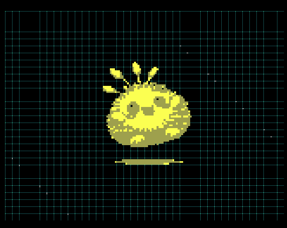

<!---

This file is used to generate your project datasheet. Please fill in the information below and delete any unused
sections.

You can also include images in this folder and reference them in the markdown. Each image must be less than
512 kb in size, and the combined size of all images must be less than 1 MB.
-->

## How it works

A previously extracted MOSS GIF and sound file have been converted to LUTs and are being played on repeat.

The sprite ROM stores 4 animation frames at 64×64 pixels, scaled 4× and centered on a 640×480 VGA display. The background should imitate some 'electricity' flowing. The audio ROM holds 1-bit samples played back via 1-bit PCM on `uio[7]`.

### Source GIF

### VGA Output

## How to test

Connect the TinyVGA PMOD to the Out PMOD and an Audio PMOD to the Bidir PMOD. Pull `ui_in[0]` high to mute audio.

## External hardware

- TinyVGA PMOD
- Audio PMOD

## Acknowledgements

Special thanks to **swisschips** for making this project possible. [SwissChips](http://swisschips.ethz.ch/)

### Honorary Moss

